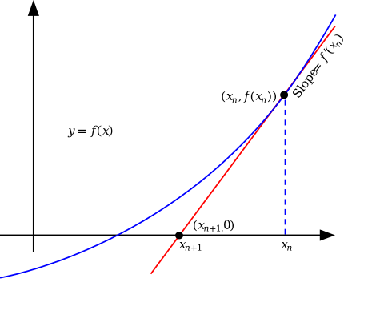

# Fundamentals of Interest Rates

## TL;DR

- Interest rates represent the price of borrowing money, reflecting the time value of money and human impatience.
- The impatience theory of interest suggests that interest rates are determined by people's preference for present goods over future goods.
- Real interest rate accounts for inflation, while nominal interest rate doesn't.
- Interest rates are influenced by factors like impatience levels, future expectations, and wealth distribution.
- The concept of interest has been debated from moral and religious perspectives throughout history.
- Various formulas (FV, PV, PMT, NPER, RATE) are used to calculate different aspects of loans and investments, based on the time value of money equation.

## Introduction

Have you ever wondered why there's an interest rate for a loan? Why do we need to pay interest on borrowed money? Can interest rates be negative? In this chapter, we will explore the fundamentals of interest rates and their relationship with the consumer credit industry.

*Disclaimer: I am not an economist. The following content is based on my understanding of the subject matter.*

## The Impatience Theory of Interest

> By definition, the rate of interest is the price of capital in terms of income, when both capital and income are measured in terms of the same unit, as, for instance, of money; or, what amounts to the same thing, the rate of interest is the excess above par which has to be paid for this year's money in terms of next year's money. - Irving Fisher [^1]

Irving Fisher explains the connection between capital, income, time, and rate of interest. "The rate of interest is the price of capital in terms of income" means that the interest rate reflects how much income (or return) you can expect to receive from your capital (or investment). "Measured in terms of the same unit" means that both capital and income are measured in the same unit, for example, money/dollars. "The rate of interest is the excess above par which has to be paid for this year's money in terms of next year's money" means that the interest rate is the premium you have to pay to obtain money today in exchange for repaying money in the future.

The key questions to be answered are:
- Why should there be an excess? Or why is there a rate of interest?
- What principles determine the amount of this excess?

### Theories

There are a number of theories that attempt to explain the rate of interest. I found the impatience theory of interest to be the most convincing (*Again, I am not an economist who follows interest rate theories closely*). For example, one theory suggests that the rate of interest depends on the amount of money in circulation. The more money in circulation, the lower the interest rate. The less money in circulation, the higher the interest rate. However, a plentiful money supply raises demand for loans just as much as it raises supply. The "feeling" probably comes from the observation that if bank reserves are low, banks will raise the interest rate to protect their reserves. But this is just relative scarcity from the bank's perspective, not an absolute scarcity.

Another theory is that interest is due to the productivity of capital--because 5% is what investments pay. But why does capital have a price in the first place? It is simply discounting future income, and during this process, we need to assume a rate of interest. It is a tautology.

The Agio Theory states that most of us prefer present goods over future goods of like kind and number, due to the "technical superiority of present over future goods" (Production is round-about, meaning it takes time. The same amount of input can yield a greater output in the future.), people having a natural preference for satisfying their needs and desires sooner rather than later, and uncertainty of the future. However, planting an apple tree today will yield the same or roughly the same amount of apples in a year.

The rate of interest is impatience crystallized into a market rate. It can be expressed in numbers as the premium that a person is willing to pay for this year's money over next year's money. Fundamentally, the reason for human impatience is that human life expectancy is limited. Also, humans lack the foresight to predict their future needs and wants. Those who have a high rate of impatience strive to acquire more present income at the cost of future income, tending to raise the interest rate. These are the borrowers, spenders, and sellers of assets. On the other hand, those who have a lower rate of impatience strive to acquire more future income at the cost of present income, tending to lower the interest rate. These are the lenders, savers, and investors.

There are three scenarios that can help you understand interest rates:

1. Increased impatience: the real interest rate increases and stock prices go down.
2. Increased optimism about future endowments: the real interest rate increases and stock prices go down. This is a bit counter-intuitive. The reason is that future endowments are expected to be higher, so why not spend the money today?
3. Wealth transfer from poor to rich: assuming the rich have a lower rate of impatience, the real interest rate decreases and stock prices go up.

### The Distinction between Real and Nominal Interest Rates

The nominal interest rate is the rate of interest in terms of money, without accounting for inflation. The real interest rate is the rate of interest in terms of goods, accounting for inflation. The relationship between the two is: $1+r = (1+i)/(1+\pi)$, where $r$ is the real interest rate, $i$ is the nominal interest rate, and $\pi$ is the inflation rate. 

The interest we usually talk about at work is the nominal interest rate.

### Further Reading

If you are interested in the theory of interest in mathematical terms, I recommend reading the note prepared by Jonathan Levin, an American economist and the 13th President of Stanford University, on [General Equilibrium](https://web.stanford.edu/~jdlevin/Econ%20202/General%20Equilibrium.pdf). In short, Fisher's theory of interest is a reduction to the general equilibrium model. I also found the [Financial Theory Coure from Yale University](https://oyc.yale.edu/economics/econ-251) to be very useful.

### The Moral Aspect of Interest Rates

It's also interesting to mention some moral views on interest rates, as I have heard some of our colleagues express discomfort about charging interest.

> The most hated sort [of wealth-getting], and with the greatest reason, is usury, which makes a gain out of money itself, and not from the natural use of it. For money was intended to be used in exchange, but not to increase at interest. - Aristotle, Politics

> "But love your enemies, do good to them, and lend to them without expecting to get anything back." - Luke 6:35, Bible

> "Those who consume interest cannot stand [on the Day of Resurrection] except as one stands who is being beaten by Satan into insanity. That is because they say, 'Trade is [just] like interest.'" - Quran 2:275, Islam

> "You shall not charge interest on loans to your brother, interest on money, interest on food, interest on anything that is lent for interest. You may charge a foreigner interest, but you may not charge your brother interest." - Deuteronomy 23:19-20, Judaism

According to Fisher, interest is just a price of impatience. Also, the nominal interest rate is irrelevant. The real interest rate can be negative, challenging the idea that all interest is inherently exploitative.

## The Computations Behind Time Value of Money Formula -- fv, pmt, nper, pv and rate

Most financial professionals are familiar with the concept of the time value of money and the respective formulas to derive future value, present value, rate, etc. While Excel, Google Sheets, or financial calculators offer convenient functions, not everyone knows what equation is being solved and how it is solved.

The core equation is the following:

$$fv + pv \cdot (1+r)^{nper} + pmt \cdot (1+r \cdot w) \cdot \frac{(1+r)^{nper}-1}{r}=0$$

where $fv$ is the future value, $pv$ is the present value, $pmt$ is the payment, $nper$ is the number of periods, $r$ is the rate, and $w$ is the type of payment (0 for end of period, 1 for beginning of period). The sign of $fv$ is the opposite of $pv$ and $pmt$.

Moving $fv$ to the right side of the equation, the first term on the left is the future value of the present value. The second term is the future value of a series of regular equal payments ([Annuity](https://en.wikipedia.org/wiki/Annuity)). Since there are 5 variables, we can expect to have 5 corresponding formulas to solve for each variable:

- `FV(rate, number_of_periods, payment_amount, [present_value], [end_or_beginning])`: solving for future value is straightforward (move all other terms except $fv$ to the right side of the equation).
- `PV(rate, number_of_periods, payment_amount, [future_value], [end_or_beginning])`: solving for present value is straightforward (move all other terms except $pv$ to the right side of the equation).
- `PMT(rate, number_of_periods, present_value, [future_value], [end_or_beginning])`: solving for payment is straightforward (move all other terms except $pmt$ to the right side of the equation).

Solving for $nper$ and $r$ is more complicated. Let's start with $nper$: `NPER(rate, payment_amount, present_value, [future_value], [end_or_beginning])`. Let $z$ = $pmt \cdot (1+r \cdot w)/r$. Grouping terms involving $(1 + r)^{nper}$, we have:

$$\begin{aligned}
    fv - z + \left(pv + z\right) \cdot (1 + r)^{nper} &= 0 \\
    nper &= \frac{\log\left(\frac{z - fv}{pv + z}\right)}{\log(1 + r)}
\end{aligned}$$

The `RATE` formula is the most complicated. When using the RATE function in Excel, there is an argument called "guess". Most of us will just leave it as default or even not understand why there is such a thing. It looks impossible to write the equation with $r$ on one side. To find the root of this non-linear equation, we use the Newton-Raphson method. The formula is: 

$$x_{n+1} = x_n - \frac{g(x_n)}{g'(x_n)}$$
until a sufficiently precise value, that is $g_{n+1} - g_n < \epsilon$, is reached.

We start with our initial guess $x_n$. Then the tangent line at $x=x_n$ intercepts the x-axis at $x_{n+1}$, which is a better approximation of the root. The slope of the tangent line is $g'(x_n) = \frac{g(x_n)}{x_n - x_{n+1}}$. Solving for $x_{n+1}$, we have $x_{n+1} = x_n - \frac{g(x_n)}{g'(x_n)}$. If the difference between $x_{n+1}$ and $x_n$ is less than a certain threshold, we stop the iteration.

Similar mechanics apply to the `IRR(cashflow_amounts, [rate_guess])` function.

## Types of Repayment Plans

WIP

## Commonly Used Interest Rate Metrics

WIP

## References

[^1]: Fisher, Irving. The ‘Impatience Theory’ of Interest; a Study of the Causes Determining the Rate of Interest ... Bologna, Nicola Zanichelli, 1911. http://archive.org/details/cu31924013755909.
