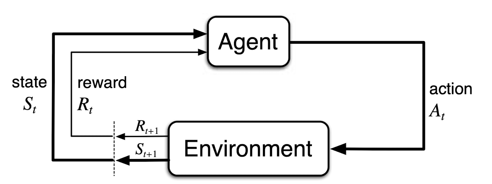
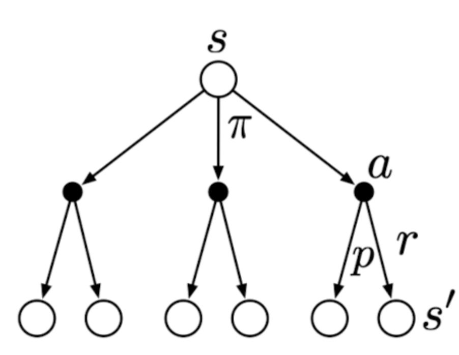

# The Art and Science of Decision Making

**Date:** August 2024
**Last updated:** August 2024

## TL;DR

Credit risk management involves complex decision-making, often driven by experience rather than innate ability. This article explores how reinforcement learning (RL) can provide a scientific framework for these decisions, focusing on trial-and-error search and delayed rewards, which are key features of credit risk policy-making. Unlike traditional supervised learning, credit risk decisions require navigating uncertainty without immediate feedback. RL offers a structured approach to managing these challenges by optimizing policies over time, but implementing it fully in credit risk management faces hurdles, including the integration of automated systems and trust in machine-driven decisions.

## Introduction

I vividly remember the early days of my career in credit risk management. I was initially impressed by the sharp minds around me, people who made quick and confident decisions on approvals, credit limits, and pricing. They seemed to have an innate sense of what was right and wrong. However, as I gained more experience, I realized that their decisiveness wasn't solely due to being smarter; rather, it stemmed from the wealth of experience they had accumulated. With time, I began to understand the rationale behind their decisions and even identified areas for improvement. Their experience allowed them to take shortcuts in the decision-making process, often without fully explaining their reasoning. The moral of the story is that for new joiners, there’s no need to be afraid or stressed if you can't immediately follow along. Remember, the seasoned professionals around you rely on their experience, not just innate ability. With time, persistence, and a willingness to learn, you'll build the same confidence and intuition. Trust the process, and don’t be afraid to ask questions or seek clarity.

What intrigues me most is the mechanism behind the decisions made by seasoned professionals. Even more fascinating is imagining a scenario where an agent—whether human or machine—with no prior experience in credit risk learns to make these decisions. We've seen with perfect information, as demonstrated by Deep Blue and AlphaGo Zero, that an agent can learn to master games like Chess and Go, even surpassing human experts without any prior experience. So, what can we learn from the science of decision-making?

In this session, I want to share a general scientific decision-making framework and explore how it relates to credit risk management. While this way of thinking might not directly impact your day-to-day tasks, it will help you connect your actions to the bigger picture.

## Characteristics of Credit Risk Policy Making

**Trial-and-error search** and **delayed rewards** are two key features that distinguish credit risk management from other forms of decision-making. Unlike supervised learning, where the correct action (or label) is known in advance, credit risk policy making requires the agent to explore uncharted territory. For instance, a policy maker might lower the approval threshold to better understand the risk-return trade-off, without knowing in advance whether this decision will yield positive or negative results.

Another hallmark of credit risk policy making is the presence of delayed rewards. The consequences of a decision may not be immediately apparent; for example, granting a higher limit to a customer may lead to increased spending in immediate transactions but may also increase the predicted probability of default. The higher predicted default probability may impact your subsequent decisions, such as pricing or credit limit adjustments. Thus, each action not only influences the immediate outcome but also affects future situations and, consequently, all subsequent rewards.

Credit risk policy making differs fundamentally from both supervised and unsupervised learning. In every company I’ve worked for, there has been a specialized team of Data Scientists who build credit risk models. A common question among new joiners is why these data scientists can't directly help with making credit risk policies. Sometimes, newcomers even feel inferior to the data scientists. However, the reason is that credit risk policy making is a distinct problem. It’s not about whether data scientists can solve it, but rather about the scope of their expertise, which is primarily in building supervised machine learning models. As we've discussed, credit risk policy making is neither supervised learning nor unsupervised learning (which focuses on uncovering hidden structures in data). Although credit risk models and dataset structures are valuable tools in credit risk management, they serve as inputs rather than being the problem itself. Understanding this distinction is crucial.

Reinforcement learning (RL) is a branch of machine learning that focuses on solving decision-making problems with the above two characteristics.

## Reinforcement Learning

### Definition

> Reinforcement learning is a computational approach to understanding and automating goal-directed learning and decision-making. [Reinforcement Learning: An Introduction][^1]

Reinforcement learning is distinct from other computational approaches because it emphasizes learning through direct interaction with the environment, without the need for explicit supervision or a complete model of the environment.[^1]

### Elements of Reinforcement Learning

- **Policy**: A policy is a mapping from perceived states of the environment to actions to be taken in those states. It represents the agent's strategy for selecting actions at each state. For example, given a credit score of 700, a policy might dictate approving a loan with a limit of $10,000.

- **Reward Signal**: A reward signal defines the goal in a reinforcement learning problem. The agent's objective is to maximize the cumulative reward it receives over time. In credit risk management, the reward signal could be the profit generated from a portfolio of loans.

- **Value Function**: The value function specifies the expected cumulative reward an agent can anticipate from a given state. Unlike the reward signal, which indicates the immediate benefit of an action, the value function considers the long-term consequences of an action. A state may yield a low immediate reward but still have a high value over time. For instance, a policy that approves only low-risk loans may yield a lower immediate reward but have a higher value in the long run due to customer retention and continuous value generation. Conversely, high-risk loans might offer a high immediate reward but a low long-term value due to increased default rates.

    > The most important component of almost all reinforcement learning algorithms is a method for efficiently estimating values. [Reinforcement Learning: An Introduction][^1]

- **Model of the Environment** (Optional): A model predicts the next state and reward based on the current state and action. Models are used for planning, which involves simulating the environment to determine the best course of action. In credit risk management, models can be seen as simplified versions of the true environment. They may estimate the probability of transitioning to default states but often do not account for actions or predict rewards accurately. For example, the default probabilities of granting a $100 limit versus a $10,000 limit differ. It is interesting to note that the model of the environment is optional in reinforcement learning. Some algorithms, such as model-free reinforcement learning, do not require a model. (I will discuss this in more detail in future sessions.)

*The examples provided above are simplified and do not fully capture the complexity of credit risk management.*

### Finte Markov Decision Process

We consider a special case which the state and action spaces are small enough for the value function to be represented as a table. Finite Markov Decision Process (MDP) is a general problem formulation for sequential decision-making problems. It is main ideas including Bellman equations and value functions.

I considered whether to include formal mathematics in this session. I've decided to incorporate the intuition behind key concepts and use mathematics to formalize them. However, you can feel free to skip the formulas if you prefer. Reading [The Agent-Environment Interface](#the-agent-environment-interface), and the quotes from [Returns and Episodes](#returns-and-episodes) and [Policies and Value Functions](#policies-and-value-functions) should provide a good understanding of the concepts. The example from [Moody's Analytics](#example) is also a good illustration of how MDP can be applied in credit risk policy making.

### The Agent-Environment Interface

The agent-environment interface in a Markov Decision Process (MDP) is illustrated above. The agent and environment interact at each discrete time steps, $t=0,1,2,3,...$. At each time step, the agent receives a state, $S_t \in \mathcal{S}$, from the environment, where $\mathcal{S}$ is the set of all possible states. The agent then selects an action, $A_t \in \mathcal{A}(s)$ ($A$ is a function of $s$). One time step later, the agent receives a reward, $R_{t+1} \in \mathcal{R}$, and the environment transitions to a new state, $S_{t+1}$ (We use $\mathcal{R_{t+1}}$ instead of $\mathcal{R_t}$ to denote the reward due to $\mathcal{A_t}$ because it emphasizes that the next reward and next state.). The MDP ange agent together thereby give rise to a sequence or trajectory that proceeds through time: $S_0, A_0, R_1, S_1, A_1, R_2, S_2, A_2, R_3, ...$. In a finte MDP, $\mathcal{S}$, $\mathcal{A}$, and $\mathcal{R}$ are finite sets. In this case, the random variables $R_t$ and $S_t$ have well-defined discrete probability distributions dependent only on the preceding state and action. The probability of each possible value of $S_{t+1}$ and $R_{t+1}$ depends only on the immediately preceding state and action. This is known as the Markov property.

The boundary between agent and environment is not always clear. The general rule for distinguishing between the two is to define anything that cannot be changed arbitrarily by the agent as part of the environment. For example, the agent cannot change the weather, so it is considered part of the environment.

### Returns and Episodes

> That all of what we mean by goals and purposes can be well thought of as the maximization of the expected value of the cumulative sum of a received scalar signal (called reward). [Reinforcement Learning: An Introduction][^1]

> The reward sigmal is your way of communicating to the robot what you want it to achieve, not how you want it achieved. [Reinforcement Learning: An Introduction][^1]

The above two quotes are almost self-explanatory. Let's define it formally. In the simplese case, the return is the sum of the rewards: $G_t = R_{t+1} + R_{t+2} + R_{t+3} + ... + R_T$, where $T$ is a final time step. This approach is suitable in which there is a natural notion of final time step. For example, a chess game ends when the game is won, lost, or drawn. We called each game an episode. In other cases, the agent-environment interaction does not break naturally into episodes. In these cases, we define the return at time $t$ as the sum of the rewards from that time step onward: $G_t = R_{t+1} + R_{t+2} + R_{t+3} + ...$. This is called the continuinng task. The formulation is problematic because the return may be infinite. To avoid this, we introduce a discount factor, $\gamma \in [0, 1]$, to make the return finite: $G_t = R_{t+1} + \gamma R_{t+2} + \gamma^2 R_{t+3} + ... = \sum_{k=0}^{\infty} \gamma^k R_{t+k+1}$. The discount factor determines the present value of future rewards. Notice the recursive nature of the return: $G_t = R_{t+1} + \gamma G_{t+1}$, which tells us that the return at time $t$ is the immediate reward plus the discounted return at time $t+1$. 

$$\begin{aligned}
G_t &= R_{t+1} + \gamma R_{t+2} + \gamma^2 R_{t+3} + ... \\
&= R_{t+1} + \gamma (R_{t+2} + \gamma R_{t+3} + ...) \\
&= R_{t+1} + \gamma G_{t+1}
\end{aligned}$$

$G_t = \sum_{k=0}^{\infty} \gamma^k R_{t+k+1}$ can be rewritten as $G_t = \sum_{k=t+1}^{T} \gamma^{k-t-1} R_k$, including the possibility that $T=\infty$ or $\gamma=1$. This notation is unifed for both episodic and continuing tasks. For example, in an episodic task, $T=5$ and $\gamma=1$, we have $G_t = R_1 + R_2 + R_3 + R_4 + R_5$. In a continuing task, $T=\infty$ and $\gamma=0.9$, we have $G_t = R_{t+1} + 0.9 R_{t+2} + 0.9^2 R_{t+3} + ...$.

### Policies and Value Functions

> A policy is a mapping from states to probabilities of selecting each possible action. If the agent is following policy $\pi$ at time $t$, then $\pi(a|s)$ is the probability that $A_t = a$ if $S_t = s$. [Reinforcement Learning: An Introduction][^1]

> The value function of a state $s$ under a policy $\pi$, denoted $v_{\pi}(s)$, is the expected return when starting in $s$ and following $\pi$ thereafter. [Reinforcement Learning: An Introduction][^1]

$$v_{\pi}(s) = \mathbb{E}_{\pi}[G_t | S_t = s] = \mathbb{E}_{\pi}[\sum_{k=0}^{\infty} \gamma^k R_{t+k+1} | S_t = s]$$  

Similar, we define the value of taking action $a$ in state $s$ under a policy $\pi$, denoted $q_{\pi}(s, a)$, as 
$$q_{\pi}(s, a) = \mathbb{E}_{\pi}[G_t | S_t = s, A_t = a] = \mathbb{E}_{\pi}[\sum_{k=0}^{\infty} \gamma^k R_{t+k+1} | S_t = s, A_t = a]$$

Again, the value functions are defined recursively.

$$\begin{aligned}
v_{\pi}(s) &= \mathbb{E}_{\pi}[G_t | S_t = s] \\
&= \mathbb{E}_{\pi}[R_{t+1} + \gamma G_{t+1} | S_t = s] \\
&= \sum_a \pi(a|s) \sum_{s', r} p(s', r|s, a) [r + \gamma \mathbb{E}_{\pi}[G_{t+1} | S_{t+1} = s']] \\
&= \sum_a \pi(a|s) \sum_{s', r} p(s', r|s, a) [r + \gamma v_{\pi}(s')]
\end{aligned}$$

The above is the Bellman equation for $v_{\pi}(s)$. You may find it hard to proceed from the second line to the third line. I have written the explanation in my personal blog. You can find it [here](https://www.zhizhi-gewu.com/supplementary-note-of-the-derivation-of-bellman-equation-in-reinforcement-learning-an-introduction/). In short, the essence is presented in the backup diagram for $V_{\pi}$ below:

The open circle represents a state, and each solid circle represents a state-action pair. The agent could take any of the actions $a$ based on its policy $\pi$. The environment will respond with a reward $r$ and move to the next state $s'$, according to some function $p$. Therefore, the value of the state $s$ under policy $\pi$ is the sum of all possibilities, from taking an action to moving to the next state and receiving a reward. The key idea is still the recursive nature of the value function. 

### Example

I took the example from Moody's Analytics titled "Determining the Optimal Dynamic Credit Card Limit" [^2]. The paper uses MDP to formulate a framework to determine the optimal credit card limit. The state space consists of the balance band, $b$, and the behavior scores band, $s$. The action space consists of the credit limit, $l$. The reward is the sum of Loss Given Default (LGD) and profit earned if not defaulted, $(-pd(s_t)b_t + (1-pd(s_t))rb_t)$, where $r$ is the interest rate, $pd$ is the probability of default given the score band.

The optimal credit limit is a policy that maximizes the expected reward.

$$\pi(b_{t-1},s_{t-1}, l_t) = \sum_{b_t,s_t} p(b_t,s_t|b_{t-1},s_{t-1},l_t) \cdot (r(1-pd(s_t))b_t - pd(s_t)b_t)$$

## The Art of Credit Risk Policy Making

As we've seen, credit risk policy-making is inherently a process of trial and error. The agent must explore the environment to learn the best course of action. However, exploration comes with risks. How do we determine what to explore and when to exploit? In short, exploration can lead to higher long-term rewards by allowing the agent to discover potentially better options. However, excessive exploration can be detrimental, preventing the agent from capitalizing on known, high-reward actions. Striking the right balance is crucial for maximizing rewards.

A useful analogy is the slot machines in casinos. A player must decide how much to explore (by trying different slot machines) and how much to exploit (by sticking with the current machine). The player must also determine when to switch from exploration to exploitation. This is known as the exploration-exploitation dilemma. The optimal solution likely lies somewhere between sticking with one machine and switching too frequently.

Similarly, in credit risk policy-making, we need to explore the unknown to discover better strategies while also exploiting proven, high-reward policies—such as approving higher-risk users, granting higher credit limits, or adjusting pricing. There is no definitive scientific formula for solving the exploration-exploitation dilemma; it is more of an art. In my experience, a good rule of thumb is to test more aggressively if progress stalls, and when things are going well, continue testing but make only small, incremental changes.

## Future Directions

If we can formalize credit risk policy making as a reinforcement learning problem, we could potentially solve it computationally. But is crafting credit risk policies as complex as mastering the game of Go? I don't think so—though this is more of a gut feeling—since the number of possible decisions in credit risk management likely isn’t as vast. The real challenge, however, might be one of trust. Will banks trust a machine to make these crucial decisions? Perhaps we could start by limiting the potential loss a machine can incur and comparing its performance to that of human experts.

Another significant hurdle is the lack of integrated systems to efficiently gather inputs and execute the outputs of automated agents. Many credit risk systems still operate in a semi-automated manner, with numerous offline processes. Bridging this gap will be essential for fully leveraging computational approaches in credit risk policy making.

## Model-Free Reinforcement Learning

Coming.

## Efficient Search Algorithms

RL is a framework general enough to solve decision-making problems, but the efficiency of the search algorithm is crucial. Some principles from recent research in search algorithms can be relevant to credit risk policy making. I will discuss this in the next session: [Efficient Search Algorithms](search_algorithms.md).

## References

[^1]: Sutton, Richard S., and Andrew G. Barto. Reinforcement Learning: An Introduction. Second edition. Cambridge, Massachusetts: The MIT Press, 2018.

[^2]: Licari, Juan, Olga Loiseau-Aslanidi, Vera Tolstova, and Masood Sadat. ‘Determining the Optimal Dynamic Credit Card Limit’, February 2021.
