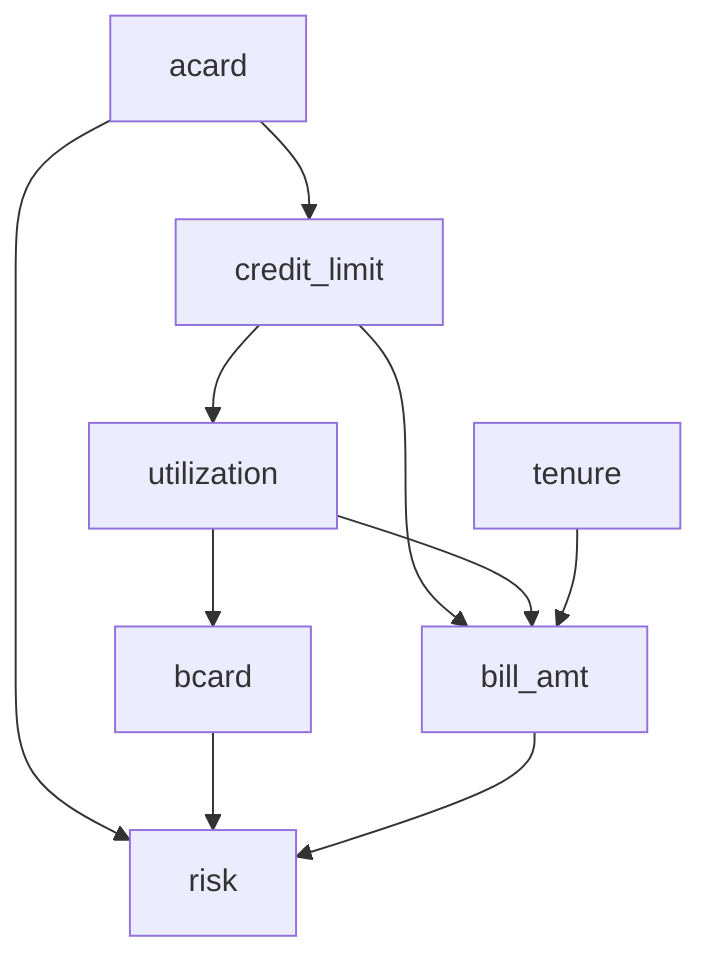

# Estimating the Response to Interventions (WIP)

**Date:** September 2024

**Last Update:** September 2024

## TL;DR

You can safely ignore the following sections:

## Causation vs Association

In credit risk management, distinguishing between causation and association is crucial, as teams make decisions and take actions (interventions) that can alter the system and distribution. While association indicates a relationship between variables, causation implies that one variable directly influences another. This distinction is fundamental when estimating the response to interventions.

Although association can provide valuable insights, it is insufficient for making informed decisions about interventions in credit risk management for several reasons:

1. Spurious Correlations: Associations can be misleading. For instance, ice cream sales and drownings might correlate, but both are influenced by warm weather. In credit risk, the number of credit cards a person has might correlate with default likelihood, but this could be due to factors like income or financial literacy, not a direct cause-effect relationship.

2. Reverse Causality: Associations don't indicate the direction of causality. For example, a positive association between credit utilization and default risk could mean that lower utilization reduces default risk, or that people at lower risk of default tend to use less of their available credit.

3. Confounding Variables: Associations may not account for confounding variables that influence both the predictor and the outcome. For instance, the association between loan amount and default risk might be confounded by factors like income.

4. Limited Predictive Power: While associations can be useful for prediction under stable conditions, they may fail when interventions change the underlying system or distribution. For example, a credit risk model might have strong predictive power for default risk, but it may not accurately predict the effect of a limit increase on default risk or for an unseen population.

5. Inability to Inform Interventions: Associations alone cannot tell us how a system will respond to interventions. Knowing that high debt-to-income ratios are associated with higher default rates doesn't necessarily mean that helping customers reduce their debt-to-income ratio will lower default rates.

6. Lack of Counterfactual Reasoning: Associations don't allow for counterfactual thinking, which is crucial for understanding the potential outcomes of different interventions. We can't use associations to answer "what if" questions about alternative actions. For example, what if we offer a higher interest rate to customers, will it increase profit?

7. Time-Dependent Relationships: Associations may change over time or under different circumstances, limiting their usefulness for long-term decision-making or in new contexts.

Relying solely on associations for decision-making in credit risk management can lead to actions that appear logical but may be misleading or even counterproductive. Consider the following scenarios:

1. Credit Card Ownership: A negative association between the number of credit cards and default risk might suggest offering higher credit limits to customers with multiple cards. However, this could inadvertently increase their repayment burden, potentially leading to financial stress.

2. Credit Utilization: Due to reverse causality, we might offer higher credit limits to customers with high utilization, believing it will reduce default risk by lowering the utilization rate. In reality, these customers might be less likely to repay, and increasing their limit could exacerbate the problem.

3. Risk Assessment: We may be overly optimistic in offering credit limits to customers predicted to have low default risk based on their current financial snapshot. However, this assessment might not account for how their risk profile changes under a higher limit, potentially resulting in significantly increased risk.

These examples illustrate the importance of understanding causal relationships, rather than mere associations, when making decisions in credit risk management. Failure to do so can lead to unintended consequences and increased financial risk for both the lender and the borrower.

Judea Pearl, in his seminal work "The Book of Why," emphasizes the importance of causal reasoning in understanding and predicting the effects of interventions. He introduces the concept of the "Ladder of Causation," which consists of three levels:

1. Association (Seeing): This is the most basic level, where we observe correlations between variables. For example, we might notice that customers with higher credit scores tend to have lower default rates.

2. Intervention (Doing): This level involves predicting the effects of deliberate actions or interventions. In credit risk management, this could be estimating the impact of offering a higher credit limit on the likelihood of loan repayment.

3. Counterfactuals (Imagining): The highest level of causal reasoning, involving the ability to reason about what would have happened if we had acted differently in the past. For instance, would a customer who defaulted have repaid their loan if we had offered them a different repayment plan?

Traditional statistical methods often operate at the first level, while truly understanding the impact of interventions requires ascending to the second and third levels. This ascent is not always straightforward in observational studies, which are common in credit risk management due to ethical and practical constraints on experimentation. This is why the scientific community developed the field of Causal Inference, which provides tools and methodologies to bridge the gap between association and causation, enabling more informed and effective decision-making in complex domains like credit risk management.

## Fundamental Problem of Causal Inference

The Fundamental Problem of Causal Inference, first articulated by statistician Donald Rubin, is a core concept in causal inference that highlights the impossibility of observing the same unit under different treatment conditions simultaneously. This problem is fundamental because it applies to all causal questions and forms the basis for many challenges in causal inference.

Key aspects of the Fundamental Problem of Causal Inference include:

1. Counterfactuals: For any given unit (e.g., an individual, a company), we can only observe one potential outcome - the outcome under the treatment they actually received. We cannot observe what would have happened if they had received a different treatment. This unobserved outcome is called the counterfactual.

2. Missing Data Problem: Because we can't observe all potential outcomes for each unit, causal inference is essentially a missing data problem. We're always missing at least one potential outcome for each unit.

   Here's a table example to illustrate this missing data problem:

   | Customer | Received Credit Limit Increase | Outcome if Increased | Outcome if Not Increased |
   |----------|--------------------------------|-----------------------|--------------------------|
   | A        | Yes                            | Default               | ?                        |
   | B        | No                             | ?                     | No Default               |
   | C        | Yes                            | No Default            | ?                        |
   | D        | No                             | ?                     | Default                  |

   In this table, '?' represents the unobserved (counterfactual) outcome. We can never know what would have happened to Customer A if they hadn't received a credit limit increase, or what would have happened to Customer B if they had.

It's important to note that all solutions to the Fundamental Problem of Causal Inference are essentially effective methods to impute the '?' in our missing data table. These methods, such as propensity score matching, difference-in-differences, instrumental variables, and randomized controlled trials, aim to estimate what would have happened in the counterfactual scenario. While these methods can't perfectly solve the missing data problem, they provide rigorous approaches to estimate causal effects under certain assumptions.

### The Bias of Using Observational Data to Estimate Causal Effects

## Causal Models

Causal models provide frameworks for understanding and estimating causal relationships. In the field of causal inference, two primary frameworks have emerged: the Potential Outcomes Framework and Structural Causal Models. These frameworks offer different perspectives and tools for addressing causal questions, each with its own strengths and applications.

The existence of two frameworks in causal inference is not a contradiction but rather a complementary approach to understanding causality. Here's why we have these two frameworks:

1. Different Perspectives:
   - The Potential Outcomes Framework focuses on comparing potential outcomes under different treatments.
   - Structural Causal Models emphasize the underlying mechanisms and relationships between variables.

2. Complementary Strengths:
   - Potential Outcomes are particularly useful for estimating average treatment effects and are well-suited for experimental designs.
   - Structural Causal Models excel in representing complex systems and are powerful for answering counterfactual questions.

Understanding both frameworks provides researchers and practitioners with a richer toolkit for addressing causal questions. In many cases, insights from both frameworks can be combined to provide a more comprehensive understanding of causal relationships.

### Potential Outcomes Framework

The Potential Outcomes Framework, also known as the Rubin Causal Model, is a fundamental approach in causal inference. Developed by Donald Rubin, this framework provides a way to define and estimate causal effects using the concept of potential outcomes.

Key components of the Potential Outcomes Framework include:

1. Potential Outcomes: For each unit and each possible treatment, there is a potential outcome. For example, in credit risk management:
   - $Y(1)$: The outcome if a customer receives a credit limit increase
   - $Y(0)$: The outcome if the same customer does not receive a credit limit increase

2. Treatment Assignment: Denoted as $T$, where $T=1$ if the unit receives the treatment and $T=0$ otherwise.

3. Observed Outcome: $Y = TY(1) + (1-T)Y(0)$

4. Causal Effect: Defined as the difference between potential outcomes, e.g., $Y(1) - Y(0)$

5. Average Treatment Effect (ATE): $E[Y(1) - Y(0)]$

The framework relies on several key assumptions:

- Stable Unit Treatment Value Assumption (SUTVA): The potential outcomes for any unit do not vary with the treatments assigned to other units.
- Ignorability: Treatment assignment is independent of potential outcomes, given observed covariates.
- Positivity: Every unit has a non-zero probability of receiving each treatment.

### Structural Causal Models

Structural Causal Models (SCMs), also known as Structural Equation Models (SEMs), provide a framework for representing and analyzing causal relationships between variables. Developed by Judea Pearl and others, SCMs offer a powerful tool for understanding complex causal systems.

Key components of Structural Causal Models include:

1. Variables: Endogenous (determined within the model) and exogenous (determined outside the model).

2. Functional Relationships: Equations that describe how variables are determined by other variables.

3. Directed Acyclic Graph (DAG): A graphical representation of the causal relationships between variables.

4. Structural Equations: Mathematical expressions that define each endogenous variable as a function of its direct causes and an error term.

5. do-operator: A mathematical tool for intervening on variables and computing counterfactuals.

Example in credit risk management:

Variables:

- credit_limit: The maximum amount of credit extended to a customer
- utilization: The proportion of credit limit being used
- bill_amt: The total amount billed to the customer
- tenure: The duration of the loan (loan tenure)
- acard: Application scorecard (a tool used to evaluate credit applications)
- risk: The level of credit risk associated with the customer
- bcard: Behavioral scorecard (a tool used to assess ongoing customer behavior)

Causal Relationships:
(Represented as directed edges in the DAG)

Functional Relationships:
(Using placeholder functions to represent the relationships)

- $credit\_limit = f_{credit\_limit}(acard)$
- $risk = f_{risk}(acard, bcard, bill\_amt)$
- $utilization = f_{utilization}(credit\_limit)$
- $bill\_amt = f_{bill\_amt}(credit\_limit, utilization, tenure)$
- $bcard = f_{bcard}(utilization)$

These functional relationships form the structural equations of the SCM, defining how each variable is determined by its direct causes. Note that in this representation, we've removed the error terms (ε) since there is no endogenous variable.

These SCMs also incorporate important graph structures and criteria that help in identifying and estimating causal effects:

1. Backdoor Criterion: A set of variables that blocks all "backdoor" paths between a treatment and an outcome. Controlling for these variables allows for unbiased estimation of causal effects.

   Example in credit risk:
   risk ← utilization → bill_amt

   Here, utilization satisfies the backdoor criterion for estimating the effect of bill_amt on risk. If we do not control for utilization, the effect of bill_amt on risk may be impacted by the common cause.

2. Frontdoor Criterion: Used when backdoor paths are not identifiable. It involves finding an intermediate variable that mediates the entire effect of the treatment on the outcome.

   Example:
   credit_limit → utilization → risk
   
   Here, utilization satisfies the frontdoor criterion for estimating the effect of credit_limit on risk.

3. Colliders: Variables that are common effects of two or more variables in the model. Conditioning on colliders can introduce spurious associations.

   Example:
   

4. Instrumental Variables: Variables that affect the treatment but not the outcome directly, useful for estimating causal effects in the presence of unmeasured confounding.

   Example:
   acard → credit_limit → risk
   
   Here, acard could be an instrumental variable for estimating the effect of credit_limit on risk.

5. Mediation: Analysis of direct and indirect effects of a treatment on an outcome through intermediate variables.

   Example:
   credit_limit → bill_amt → risk
   credit_limit → risk
   
   Here, we can analyze both the direct effect of credit_limit on risk and the indirect effect through bill_amt.

6. Explain-Away Effect: This occurs when two independent causes of a common effect become dependent when conditioning on that effect. It's also known as Berkson's paradox or selection bias.

   Example in credit risk:
   acard → credit_limit ← bcard

SCMs allow for:

- Counterfactual reasoning: "What if we had intervened on $X$?"
- Mediation analysis: Understanding direct and indirect effects
- Identification of causal effects from observational data

Advantages of SCMs:

- Explicit representation of causal mechanisms
- Ability to answer a wide range of causal queries
- Integration of domain knowledge into the model

Challenges:

- Requires strong assumptions about the causal structure
- Can be complex for large systems
- Sensitivity to model misspecification

## Treatment Effect

1. ITE (Individual Treatment Effect):
   - Measures the causal effect of a treatment on a specific individual.
   - Represents the difference in potential outcomes for an individual under treatment vs. control.
   - Challenging to estimate directly due to the fundamental problem of causal inference.

2. CATE (Conditional Average Treatment Effect):
   - The average treatment effect for a subgroup with specific characteristics.
   - Useful for understanding heterogeneous treatment effects across different populations.
   - Often estimated using machine learning methods for personalized predictions.

3. ATE (Average Treatment Effect):
   - The average causal effect of a treatment across the entire population.
   - Represents the expected difference in outcomes between treated and control groups.
   - Commonly used in randomized controlled trials and observational studies.

4. LATE (Local Average Treatment Effect):
   - The average treatment effect for compliers in instrumental variable settings.
   - Applicable when there's imperfect compliance with treatment assignment.
   - Provides insights into the effect of treatment on those influenced by the instrument.

5. ATT (Average Treatment Effect on the Treated):
   - The average effect of treatment specifically for those who received the treatment.
   - Useful when treatment effects may differ between treated and untreated populations.
   - Often relevant in policy evaluation where we want to know the impact on those who actually received an intervention.

6. QTE (Quantile Treatment Effect):
   - Measures the treatment effect at different quantiles of the outcome distribution.
   - Useful for understanding how treatment impacts vary across the outcome spectrum.
   - Provides a more comprehensive view of treatment effects beyond averages.

Why the best estimator for the CATE is also the best estimator for the ITE?

## Randomized Controlled Trials

## No Free Lunch in Causal Inference

https://p-hunermund.com/2018/06/09/no-free-lunch-in-causal-inference/

## Estimating Treatment Effect If Randomized Controlled Trials Are Available

### The Unreasonable Effectiveness of Linear Regression

### Uplift Models

## Estimating Treatment Effect If Randomized Controlled Trials Are Not Available

- Matching
- Difference-in-Differences
- Instrumental Variables

## State-of-the-Art Approaches and Decision Flow

https://econml.azurewebsites.net/spec/flowchart.html

## Applications in Credit Risk Management

### Adjustment of Limit and Pricing

### Non Performing Account Management

## Paradox

- Simpson's Paradox

## References

### Theoretical Foundations

- Morgan, Stephen L., and Christopher Winship. Counterfactuals and Causal Inference Methods and Principles for Social Research. Second edition. New York, NY: Cambridge University Press, 2015.

### Practical References

- Facure, Matheus. Causal Inference in Python: Applying Causal Inference in the Tech Industry. Beijing Boston Farnham Sebastopol Tokyo: O’Reilly Media, 2023.

### For General Readers

- Pearl, Judea, and Dana Mackenzie. The Book of Why: The New Science of Cause and Effect. First trade paperback edition. New York: Basic Books, 2020.

### Packages for Causal Inference

- [CausalML](https://github.com/uber/causalml)
- [EconML](https://github.com/microsoft/EconML)
- [DoWhy](https://github.com/microsoft/dowhy)
