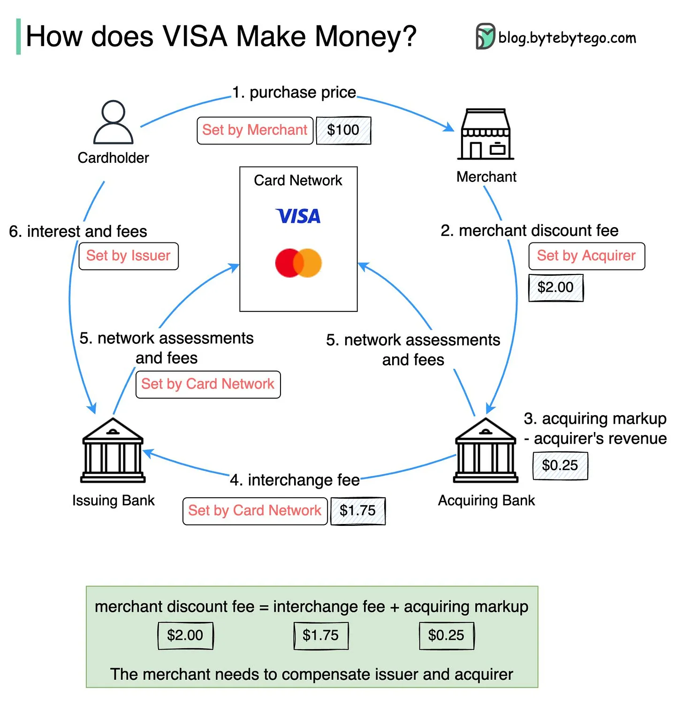

# Common Product Structures in Consumer Finance

**Date:** October 2024

**Last Update:** October 2024

## Consideration of Product Structures

Financial products require a careful balance between business volume (revenue) and risk (cost) from inception, which differs from typical consumer products where business models can be optimized post-launch. Establishing the right product structure is fundamental to credit business sustainability. This is particularly important because financial products have universal appeal when perceived as "free money," yet their structure - including repayment frequency and maturity - directly impacts customers' ability and likelihood to repay. Therefore, thoughtful product design that aligns business objectives with risk management is essential from the start.

When evaluating product structures, I consider the following key dimensions:

- **Use Case and Acquisition Channels (Frontend)**: The primary use case defines both the target user segment and user quality. Understanding this is critical for product positioning.

- **Limit and Limit Type (Backend; Risk Management)**: These parameters determine risk exposure levels and should align closely with the intended use case.

- **Repayment Plan (Backend; Risk Management)**: The maturity period and repayment frequency significantly influence customer repayment behavior and must be carefully structured.

- **Collateral (Backend; Risk Management)**: The presence of collateral or required down payments can effectively mitigate risk exposure.

- **Interest Rate and Fees (Frontend and Backend; Target User and Risk Management)**: Interest rates not only define the target customer segment but also establish the acceptable margin of error for risk management.

## **Comparison of Consumer Finance Products**

| **Characteristics**             | **Credit Card (Revolving)** | **Credit Card Installment Plans** | **Buy Now Pay Later (BNPL)** | **Peer-to-Peer (P2P) Lending** | **Payday Loan** | **Pay in 4** | **56 Loan (Philippines); 9出13归 (Hong Kong)** | **Auto Title Loans** | **Store Credit Cards** | **Personal Loans** | **Secured Personal Loans** |
|--------------------------------|----------------------------|-----------------------------------|----------------------------|--------------------------------|-----------------|--------------|---------------------------------------------|--------------------|--------------------|------------------|--------------------------|
| **Source of Fund**             | Issuing Bank               | Issuing Bank                      | Fintech Companies, Merchants | Individual Investors via Online Platforms | Non-Bank Financial Institutions | Fintech Companies, Merchants | Non-Bank Financial Institutions | Specialized Lenders | Retailers/Financial Partners | Banks, Credit Unions, Online Lenders | Banks, Credit Unions |
| **Limit Type**                 | Revolving                  | Instalment                        | Instalment                 | Term Loan                       | Term Loan       | Instalment   | Instalment                                  | Term Loan          | Revolving           | Term Loan         | Term Loan               |
| **Repayment Frequency**        | Monthly                    | Monthly                           | Bi-weekly/Monthly          | Monthly                         | Single Payment  | Initial + Bi-weekly | Weekly/Bi-weekly                           | Monthly            | Monthly             | Monthly           | Monthly                 |
| **Repayment Maturity**         | Revolving (no fixed end date) | Short to Medium-term          | Short-term (weeks to months) | Short to Medium-term           | Very Short-term (1-4 weeks) | 6 weeks | Short-term (1-3 months) | Short to Medium-term | Revolving (no fixed end date) | Medium to Long-term | Medium to Long-term |
| **Repayment Payment**          | Minimum monthly payment    | Fixed Monthly Payments            | Equal installment payments  | Fixed Monthly Payments          | Lump Sum Payment | 4 Equal Payments (1 upfront + 3 bi-weekly) | Fixed Payments | Fixed Monthly Payments | Minimum Monthly Payment | Fixed Monthly Payments | Fixed Monthly Payments |
| **Secured or Unsecured**       | Unsecured                  | Unsecured                         | Unsecured                  | Unsecured or Secured            | Unsecured       | Unsecured    | Unsecured                                   | Secured (Vehicle)   | Unsecured           | Unsecured or Secured | Secured                  |
| **Interest Rate and Fees**     | **Interest Rate:** High **Common Fees:** - Annual Fee - Late Payment Fee - Balance Transfer Fee - Foreign Transaction Fee **Additional Notes:** - Rewards programs may offset some fees for frequent users | **Interest Rate:** Moderate **Common Fees:** - Setup Fee - Late Payment Fee - Early Repayment Fee **Additional Notes:** - Converts large purchases into fixed monthly payments - Lower interest rates compared to revolving credit if paid on schedule - Predictable payment schedule for better budgeting | **Interest Rate:** Zero to Moderate **Common Fees:** - Late Fee - Service Fee - Interest on Extended Terms **Additional Notes:** - Often interest-free if paid on schedule - Higher penalties for missed payments | **Interest Rate:** Moderate **Common Fees:** - Platform Fee - Origination Fee - Late Payment Fee **Additional Notes:** - Rates based on borrower's credit profile - Transparent fee structure - Direct lending between individuals - Flexible terms compared to traditional banks | **Interest Rate:** Very High **Common Fees:** - Flat Fee Based on Loan Amount - Rollover Fee **Additional Notes:** - Extremely high APR - Intended for emergency short-term borrowing | **Interest Rate:** Usually Zero **Common Fees:** - Late Fee - Failed Payment Fee **Additional Notes:** - Interest-free if paid on schedule - First payment at purchase, followed by 3 bi-weekly payments - Simple and transparent payment structure - Growing alternative to traditional credit | **Interest Rate:** Very High **Common Fees:** - Origination Fee - Late Payment Fee **Additional Notes:** - 56 Loan: Borrow 5000, repay 6000 in Philippines - 9出13归: Borrow 9000, repay 13000 in Hong Kong - Popular short-term loan product in Southeast Asia | **Interest Rate:** High **Common Fees:** - Origination Fee - Late Payment Fee **Additional Notes:** - Vehicle title used as collateral - Risk of vehicle repossession on default - Lower rates than unsecured short-term loans | **Interest Rate:** High **Common Fees:** - Annual Fee - Late Payment Fee - Penalty APR **Additional Notes:** - Store-specific rewards and benefits - Generally higher APR than general-purpose credit cards | **Interest Rate:** Low to Moderate **Common Fees:** - Origination Fee - Prepayment Fee - Late Payment Fee **Additional Notes:** - Rate depends on credit score and security - Longer terms available - More formal underwriting process | **Interest Rate:** Low **Common Fees:** - Origination Fee - Late Payment Fee **Additional Notes:** - Collateral reduces interest rate - Common collateral includes savings accounts, CDs, or vehicles - Lower risk for lenders |
| **Use Cases**                  | Everyday purchases, Building credit | Large purchases, Budget Management | Online shopping, Retail purchases | Personal Loans, Debt Consolidation | Emergency Expenses | Online Shopping, Small-Medium Purchases | Emergency Expenses | Emergency Expenses | Store-specific Purchases | Large Purchases, Debt Consolidation | Large Purchases, Debt Consolidation |
| **Sales Channel**              | Online, Bank Branches, Retail Partners | Online, Bank Branches, Retail Partners | E-commerce Platforms, Retail Stores | Online P2P Platforms | Online, Physical Stores | E-commerce Sites, Retail Partners | Online, Physical Stores | Physical Stores | Retail Stores, Online | Online, Bank Branches | Bank Branches, Online |

## Supplementary Notes on Credit Card Model

### Three-Party vs Four-Party Credit Card Models

The credit card industry operates primarily under two main models: the three-party model (closed loop) and the four-party model (open loop).

#### Three-Party Model (Closed Loop)

In a three-party model, the key parties are:

1. The cardholder (consumer)
2. The merchant
3. The card issuer/network (single entity)

Examples include American Express and Discover, where the company acts as both the card issuer and payment network. Key characteristics:

- Direct relationships with both cardholders and merchants
- Full control over fees and terms
- Typically higher merchant fees but also higher cardholder rewards
- More integrated customer experience
- Limited acceptance compared to four-party networks

#### Four-Party Model (Open Loop)

In a four-party model, the participants are:

1. The cardholder (consumer)
2. The merchant
3. The issuing bank
4. The acquiring bank/payment network

Examples include Visa and Mastercard networks. Key characteristics:

- Broader merchant acceptance
- Shared revenue and risks among participants
- More complex fee structure
- Greater competition among issuers
- Network effects benefit all participants

